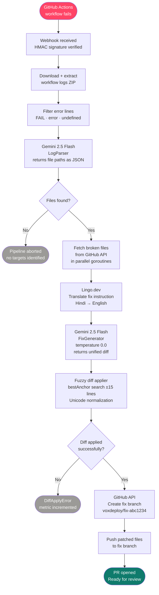
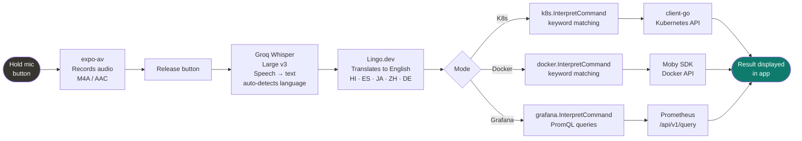
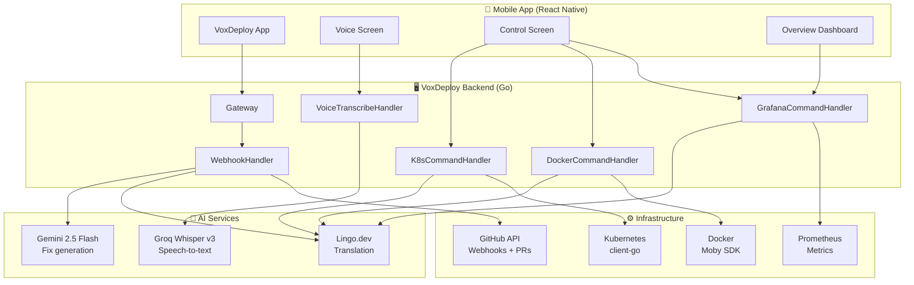
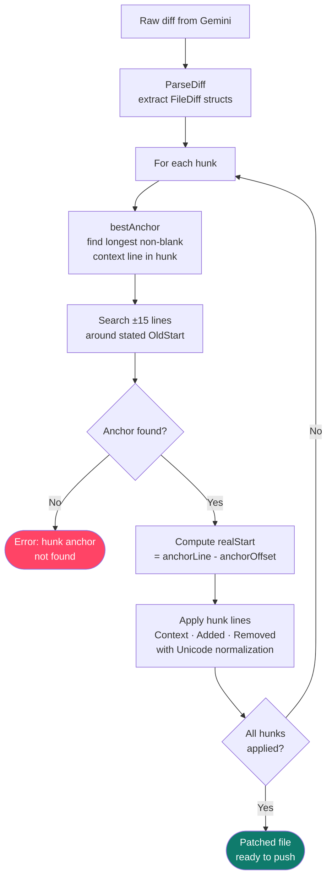

# VoxDeploy

**AI-powered CI/CD pipeline that automatically fixes broken builds and lets you control your entire infrastructure in any language.**

When your GitHub Actions workflow fails, VoxDeploy catches the webhook, reads the error logs with Gemini AI, generates a precise git diff, and opens a pull request — all without human intervention. Your engineers can also control Kubernetes clusters, Docker containers, and query metrics by speaking or typing in Hindi, Spanish, Japanese, or any other language via the companion mobile app.

---

## Screenshots

### Mobile App

| Overview | Voice Control | K8s Control |
|:---:|:---:|:---:|
|  |  |  |
| Live metrics dashboard | Multilingual voice commands | Cluster management |

| PR History | Settings | Result Output |
|:---:|:---:|:---:|
|  |  |  |
| Auto-generated fix pipeline | Repo registration | Command output |

### Auto-Fix in Action

| CI Failure Detected | AI Generates Diff | PR Opened |
|:---:|:---:|:---:|
|  |  |  |
| Webhook received | Gemini produces the fix | Branch + PR created |

> **Add your screenshots** — drop images into `docs/screenshots/` and they will appear above. Recommended size: 390×844px (iPhone 14 portrait).

---

## Architecture

### CI Auto-Fix Pipeline



### Mobile Voice Pipeline



### System Overview



### Fuzzy Diff Applier



---

## What it does

**Automatic CI repair** — A GitHub Actions failure fires a webhook. VoxDeploy downloads the logs, filters the error lines, uses Gemini to identify which files are broken, fetches those files from the repo, generates a unified diff fix at temperature 0, applies the diff with fuzzy line matching, and opens a PR on a `voxdeploy/fix-*` branch. The whole pipeline runs in under 60 seconds.

**Multilingual infrastructure control** — The mobile app (React Native / Expo) lets you send natural language commands to Kubernetes, Docker, and Grafana in any language. Commands pass through Groq Whisper for speech-to-text and Lingo.dev for translation before being interpreted and executed against your cluster.

**Multi-repo support** — Register multiple repositories with independent GitHub tokens, kubeconfigs, Docker hosts, and Grafana instances. Each webhook is routed to the correct per-repo configuration.

---

## Tech stack

| Component | Technology |
|---|---|
| Backend | Go 1.22 |
| AI fix generation | Google Gemini 2.5 Flash |
| Speech-to-text | Groq Whisper Large v3 |
| Translation | Lingo.dev |
| Mobile app | React Native (Expo) |
| Kubernetes client | `k8s.io/client-go` |
| Docker client | Moby SDK |
| Metrics | Prometheus + Grafana |
| CI integration | GitHub Actions webhooks |

---

## Project structure

```
Vortex/
├── cmd/
│   ├── server/
│   │   └── main.go                 # Entry point
│   └── internal/
│       └── api/
│           ├── handlers.go         # Webhook, K8s, Docker, Grafana handlers
│           ├── voice.go            # Groq Whisper transcription
│           ├── k8shandler.go       # Scale / restart / list REST endpoints
│           ├── register.go         # Multi-repo registration
│           └── signature.go        # GitHub HMAC verification
├── internal/
│   ├── diff/
│   │   ├── apply.go                # Fuzzy hunk applier
│   │   ├── parse.go                # Unified diff parser
│   │   ├── types.go                # FileDiff / Hunk / Line types
│   │   └── diff_test.go            # 30+ tests
│   └── metrics/
│       └── metrics.go              # Prometheus counters + histograms
├── cmd/internal/
│   ├── llm/
│   │   ├── client.go               # Gemini client (LogParser + FixGenerator)
│   │   └── prompts.go              # System prompts
│   ├── github/
│   │   ├── logs.go                 # Log download + ZIP extraction
│   │   ├── files.go                # File content fetcher
│   │   └── git.go                  # Branch create / file update / PR open
│   ├── k8s/
│   │   ├── client.go               # Kubernetes client factory
│   │   └── commands.go             # Command interpreter + executor
│   ├── docker/
│   │   ├── client.go               # Docker client factory
│   │   ├── containers.go           # Container operations
│   │   └── command.go              # Command interpreter
│   ├── grafana/
│   │   ├── client.go               # Grafana/Prometheus client
│   │   ├── commands.go             # NL query interpreter
│   │   ├── stats.go                # In-memory metrics reader
│   │   └── query.go                # PromQL executor
│   ├── lingo/
│   │   └── client.go               # Lingo.dev translation client
│   └── store/
│       └── store.go                # Per-repo config store
├── k8s/                            # Kubernetes manifests
│   ├── deployment.yaml
│   ├── service.yaml
│   ├── rbac.yaml
│   └── namespace.yaml
├── docs/
│   └── screenshots/                # Add your screenshots here
└── vortexMobile/                   # React Native app
    ├── app/
    │   ├── _layout.tsx
    │   ├── index.tsx               # Overview / metrics dashboard
    │   ├── control.tsx             # K8s + Docker + Grafana control
    │   ├── voice.tsx               # Voice + text command input
    │   ├── prs.tsx                 # PR history + pipeline steps
    │   └── settings.tsx            # Repo registration
    ├── components/
    │   ├── theme.ts
    │   ├── NotionCard.tsx
    │   ├── PropertyRow.tsx
    │   ├── CalloutBlock.tsx
    │   └── ResultBlock.tsx
    ├── hooks/
    │   └── Usevoicecommand.ts
    └── services/
        └── api.ts
```

---

## Setup

### Prerequisites

- Go 1.22+
- A GitHub repository with Actions enabled
- `kubectl` configured with access to your cluster
- Docker daemon running

### Environment variables

```bash
GITHUB_TOKEN=github_pat_...        # Personal access token (repo scope)
WEBHOOK_SECRET=your-secret         # Must match GitHub webhook configuration
GEMINI_API_KEY=AIza...             # Google AI Studio — free tier available
LINGO_API_KEY=lingo_sk_...         # lingo.dev — free tier available
GROQ_API_KEY=gsk_...               # console.groq.com — free, no credit card
PORT=8080                          # Optional, defaults to 8080
```

### Run locally

```bash
git clone https://github.com/yujiblack/Vortex.git
cd Vortex

PORT=8081 \
GITHUB_TOKEN="..." \
WEBHOOK_SECRET="secret" \
GEMINI_API_KEY="..." \
LINGO_API_KEY="..." \
GROQ_API_KEY="..." \
go run cmd/server/main.go
```

### Expose to GitHub (for local development)

```bash
ngrok http 8081
# Copy the https URL and set it as your GitHub webhook URL
```

### Configure GitHub webhook

1. Go to your repository → Settings → Webhooks → Add webhook
2. Payload URL: `https://your-ngrok-url.ngrok.io/webhook`
3. Content type: `application/json`
4. Secret: same value as `WEBHOOK_SECRET`
5. Events: select **Workflow runs**

### Register a repository

```bash
curl -X POST http://localhost:8081/repos/register \
  -H "Content-Type: application/json" \
  -d '{
    "repo": "owner/repo-name",
    "github_token": "github_pat_...",
    "webhook_secret": "your-secret",
    "kubeconfig_b64": "'$(kubectl config view --context your-context --minify --flatten | base64 -w 0)'",
    "docker_host": "unix:///var/run/docker.sock",
    "grafana_url": "http://localhost:9090",
    "grafana_token": ""
  }'
```

---

## Deploy to Kubernetes

```bash
# Create namespace and RBAC
kubectl apply -f k8s/namespace.yaml
kubectl apply -f k8s/rbac.yaml

# Create secrets
kubectl create secret generic voxdeploy-secrets \
  --from-literal=GITHUB_TOKEN="..." \
  --from-literal=WEBHOOK_SECRET="..." \
  --from-literal=GEMINI_API_KEY="..." \
  --from-literal=LINGO_API_KEY="..." \
  --from-literal=GROQ_API_KEY="..." \
  -n voxdeploy

# Deploy
kubectl apply -f k8s/deployment.yaml
kubectl apply -f k8s/service.yaml
```

---

## Mobile app

```bash
cd vortexMobile
npm install
npx expo install expo-av expo-file-system react-native-safe-area-context

# Update BASE_URL in services/api.ts to your server URL

# Run in Expo Go (typed commands, no mic)
npx expo start

# Run with full mic support
npx expo run:ios
# or
npx expo run:android
```

### App screens

**Overview** — Live metrics: webhooks caught, PRs opened, success rate, AI latency, diff errors. Auto-refreshes every 10 seconds.

**Control** — Natural language commands to Kubernetes, Docker, or Grafana. K8s pod listing, deployment scaling, pod restarts, crashing pod detection, Docker container management, Prometheus metric queries.

**Voice** — Hold the mic button and speak in any language. Groq Whisper transcribes, Lingo.dev translates to English, the command executes. Supports EN, HI, ES, JA, ZH, DE. Typed input fallback with example phrases filtered by language.

**PRs** — AI-generated summary of pipeline health, stats, link to open PRs on GitHub, visual walkthrough of the 6-step fix pipeline.

**Settings** — Register new repositories with independent credentials per repo.

---

## API endpoints

| Method | Path | Description |
|---|---|---|
| `POST` | `/webhook` | GitHub Actions webhook receiver |
| `POST` | `/k8s/command` | Natural language K8s command |
| `POST` | `/docker/command` | Natural language Docker command |
| `POST` | `/grafana/command` | Natural language metrics query |
| `GET` | `/grafana/stats` | Raw pipeline metrics JSON |
| `GET` | `/k8s/deployments` | List deployments for a repo |
| `POST` | `/k8s/scale` | Scale a deployment |
| `POST` | `/k8s/restart` | Restart a deployment |
| `POST` | `/voice/transcribe` | Audio → transcript via Groq Whisper |
| `POST` | `/repos/register` | Register a new repository |
| `GET` | `/repos` | List registered repositories |
| `GET` | `/health` | Health check |
| `GET` | `/metrics` | Prometheus metrics |

---

## How the diff applier works

The biggest engineering challenge is that Gemini occasionally miscounts line numbers when generating diffs. The fuzzy hunk applier solves this with `bestAnchor` — it finds the longest non-blank context line in each hunk and searches ±15 lines around the stated position to find the real location. Blank lines are terrible anchors (they appear everywhere), so the algorithm picks the most unique line in the hunk instead. Unicode normalization handles curly vs straight apostrophes so comment lines never cause false mismatches.

```
AI states:  @@ -30,13 +30,13 @@
Actual pos: func at line 37

bestAnchor: "func (p *Product) ApplyDiscount..." at line 36
anchorOffset = 7 (7th line into the hunk)
realStart = 36 - 7 = 29 ✓

WARNING: hunk line number corrected: stated 30, actual 29 (off by -1)
```

---

## Metrics

| Metric | Description |
|---|---|
| `voxdeploy_webhooks_received_total` | CI failures caught |
| `voxdeploy_fixes_generated_total` | Diffs successfully generated |
| `voxdeploy_prs_opened_total` | Pull requests opened |
| `voxdeploy_fix_failed_total` | Pipeline failures at any stage |
| `voxdeploy_diff_apply_errors_total` | Diff parse or apply failures |
| `voxdeploy_ai_generation_seconds` | Gemini latency histogram |
| `voxdeploy_pipeline_duration_seconds` | Full webhook-to-PR latency |
| `voxdeploy_files_patched_per_fix` | Files changed per fix |

---

## Example voice commands

| Language | Command | Action |
|---|---|---|
| 🇬🇧 English | "Show all pods" | List all pods |
| 🇬🇧 English | "Scale voxdeploy-test to 3" | Scale deployment |
| 🇬🇧 English | "Restart voxdeploy-test" | Rolling restart |
| 🇮🇳 Hindi | "सभी pods दिखाओ" | List all pods |
| 🇮🇳 Hindi | "voxdeploy-test को 3 replicas पर scale करो" | Scale deployment |
| 🇮🇳 Hindi | "crashing pods दिखाओ" | Show failing pods |
| 🇮🇳 Hindi | "AI की speed कितनी है" | Query AI latency |
| 🇪🇸 Spanish | "Mostrar todos los pods" | List all pods |
| 🇪🇸 Spanish | "Escalar voxdeploy-test a 3" | Scale deployment |
| 🇪🇸 Spanish | "Dame un resumen" | Pipeline summary |
| 🇯🇵 Japanese | "すべてのpodを表示" | List all pods |
| 🇯🇵 Japanese | "voxdeploy-testを再起動" | Restart deployment |
| 🇯🇵 Japanese | "成功率はどのくらいですか" | Query success rate |

---

## License

MIT
